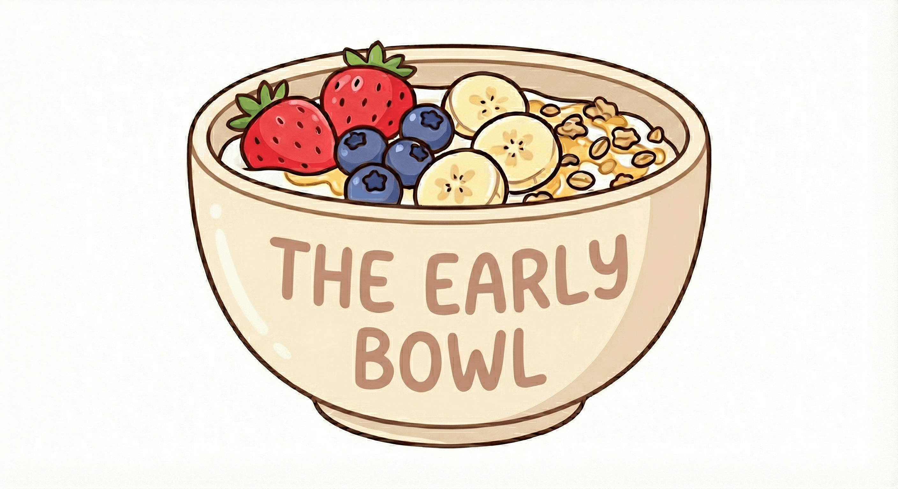

# The Early Bowl

Školní projekt z informatiky — kompletní digitální představení smyšlené snídaňové restaurace v Opavě.

## Co najdeš v repu

### 📋 Plánování a zadání
* **[ZADANI.md](ZADANI.md)** — zadání školního projektu (zdroj všech požadavků).
* **[PLAN.md](docs/PLAN.md)** — plán doručení všech deliverables, fáze, milníky, rozhodnutí.
* **[DENIK.md](docs/DENIK.md)** — laboratorní deník: chronologie práce, neúspěšné experimenty a decision log.
* **[zapis_konzultace.md](docs/zapis_konzultace.md)** — originální brief z konzultace (kotva, nemění se).

### 📐 Specifikace
* **[PRD.md](specs/PRD.md)** — funkční a technická specifikace webu (co a jak).
* **[DESIGN.md](specs/DESIGN.md)** — **single source of truth** pro vizuální identitu (paleta, fonty, komponenty, AI prompty pro ilustrace).
* **[TECH-STACK.md](specs/TECH-STACK.md)** — přehled použitých technologií a nástrojů + souhrn nákladů.

### 💻 Web
* **[web/](web/)** — skeleton statického webu (HTML/CSS/JS) připravený k naplnění; deploy na Cloudflare Pages. Detaily v [web/README.md](web/README.md).

### 📊 Vstupy pro projektovou dokumentaci
* **[menu_sablona.md](docs/menu_sablona.md)** — finální menu s ID, popisy, cenami.
* **[menu-matrix.md](docs/menu-matrix.md)** — matice vhodnosti pro diety a obsažených alergenů.
* **[marketing_plan_sablona.md](docs/marketing_plan_sablona.md)** — marketingová strategie a persony.
* **[rozpocet_sablona.md](docs/rozpocet_sablona.md)** — počáteční investice, fixní/variabilní náklady, cenotvorba, financování.

## Klíčové vlastnosti projektu

* **Brand:** hand-drawn cartoon styl podle loga, smetanovo-hnědá paleta s teplými akcenty.
* **Web:** statický (HTML/CSS/JS), generovaný s AI, deploy na Cloudflare Pages — 5 podstránek, mobile-first.
* **Ilustrace jídel:** AI-generované bitmapy podle master promptu v DESIGN.md (ne fotografie).
* **Propagační video:** HTML scény přes [HeyGen Hyperframes](https://github.com/heygen-com/hyperframes) (bez voiceoveru), slide deck v [Marp](https://marp.app/).
* **web/:** skeleton webu (HTML/CSS/JS) připravený k naplnění, vč. `stylesheet.html` — živé ukázky design systému.
* **Bez cookies, bez trackingu** → bez otravných lišt, čistý GDPR.

## Stav

Fáze 1 (MVP) — viz [PLAN.md](docs/PLAN.md) pro aktuální harmonogram.
