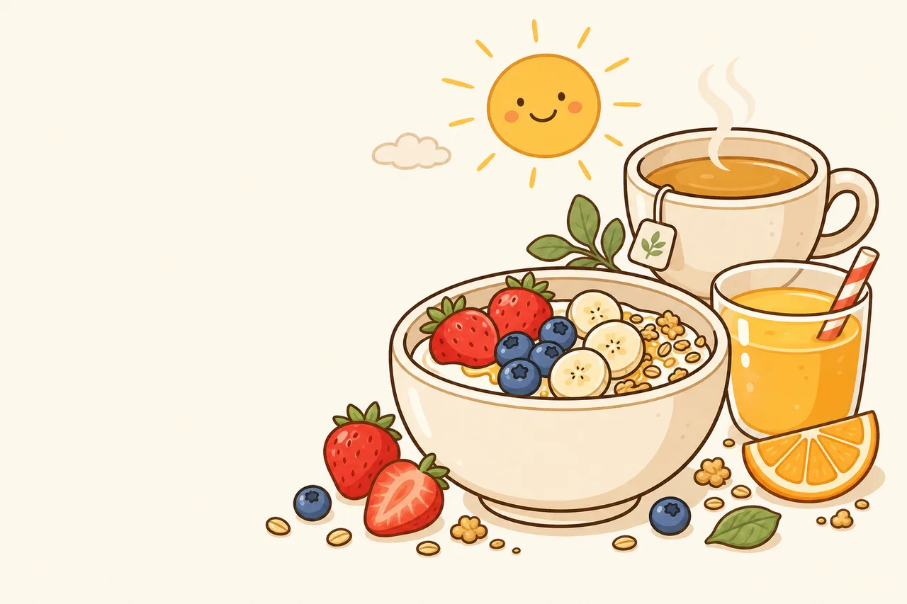

# The Early Bowl

*Projektová dokumentace k závěrečnému projektu z informatiky „Můj online business".*

**Autor:** Amélie Sam
**Škola:** Mendelovo gymnázium, Opava
**Předmět:** Informatika
**Místo a rok:** Opava 2026
**Odkaz na web:** <https://ameliesam.github.io/the-early-bowl/>

---

## Úvod

Cílem projektu bylo navrhnout fiktivní snídaňovou restauraci **The Early Bowl** a vytvořit pro ni kompletní webovou prezentaci. Restaurace má sídlit v centru Opavy (Náměstí Republiky 159/10, OD Stará Breda), otevřeno 6:00–13:30, a cílí na studenty Slezské univerzity a sportovce z nedalekého fitness centra. Web slouží jako digitální vizitka: menu, příběh značky, kontakt a otvírací doba. Tato dokumentace popisuje teoretická východiska tvorby webu i konkrétní cestu, jak projekt vznikal.

---

# A. Teoretická část

## 1. Webové technologie

### Co je web a jak funguje

**Webová stránka** je soubor (nejčastěji typu HTML), který si počítač uživatele stáhne ze vzdáleného serveru a prohlížeč jej zobrazí. Aby uživatel věděl, kam má jít, slouží **doména** — lidsky čitelná adresa typu `theearlybowl.cz`. Doména se přes systém DNS překládá na IP adresu konkrétního serveru.

**Hosting** je placená nebo bezplatná služba, která provozuje server a drží na něm soubory webu dostupné 24/7. V tomto projektu jsme zvolili **GitHub Pages** — bezplatný hosting přímo z verzovaného repozitáře, který automaticky zajišťuje šifrované HTTPS spojení. Web tak běží na generické adrese `ameliesam.github.io/the-early-bowl/` bez nutnosti platit vlastní doménu (~400 Kč/rok).

### Tři základní jazyky webu

* **HTML** (HyperText Markup Language) — definuje *strukturu* stránky (nadpisy, odstavce, obrázky, odkazy).
* **CSS** (Cascading Style Sheets) — definuje *vzhled* (barvy, fonty, rozložení, responzivitu).
* **JavaScript** — přidává *interaktivitu* (rozbalovací menu, kopírování ID do schránky).

Pro tento projekt jsme zvolili „**čistý**" stack bez frameworků jako React nebo WordPress. Pět statických stránek se totiž obejde bez složitých nástrojů, web je rychlejší, levnější a má méně bezpečnostních rizik.

### Co je CMS a proč jsme ho nepoužili

**CMS** (Content Management System) jako WordPress, Webnode nebo Shoptet je hotová „továrna na weby" — uživatel klikáním sestaví stránku, aniž by psal kód. Výhodou je rychlost a komfort, nevýhodou závislost na platformě, slabší výkon a omezená kontrola nad vzhledem. Pro tento projekt jsme chtěli **plnou kontrolu nad brandem** a maximální výkon, proto byl zvolen statický web psaný „ručně" (s pomocí AI nástrojů — viz praktická část).

### Responzivita

Více než polovina uživatelů dnes prohlíží web na mobilu. **Responzivní design** znamená, že web automaticky přizpůsobuje rozložení velikosti obrazovky. Realizuje se v CSS pomocí relativních jednotek (`%`, `rem`), flexibilního layoutu (Flexbox, Grid) a tzv. **media queries**, které mění styl podle šířky displeje.

## 2. Základy UX/UI

**UX** (User Experience) je celkový zážitek uživatele — jestli najde, co hledá, jestli mu to dává smysl, jestli se mu chce vrátit. **UI** (User Interface) je vizuální vrstva — barvy, tlačítka, typografie. UX se ptá *„funguje to dobře?"*, UI *„vypadá to dobře?"*. Dobrý web potřebuje obojí.

### Co dělá web přehledným

1. **Jasná navigace** — uživatel musí kdykoliv vědět, kde je a jak se dostane domů. V našem webu je horní menu (Úvod, Menu, O nás, Kontakt, Podmínky) na každé stránce stejné.
2. **Vizuální hierarchie** — důležité prvky (cena, tlačítko „kontaktovat") musí být na první pohled výraznější než vedlejší informace. Realizuje se pomocí velikosti, barev a prostoru.
3. **Pravidlo tří kliků** — uživatel by měl ke kterékoliv informaci dorazit nejvýše třemi kliky. U pětistránkového webu je to triviální.
4. **Kontrast a čitelnost** — text musí mít proti pozadí dostatečný kontrastní poměr (norma WCAG 2.1 AA vyžaduje 4,5 : 1). Naše paleta (hnědá `#7A5843` na smetanové `#FAF6EE`) má poměr 6,8 : 1.
5. **Rychlost** — pokud se stránka načítá déle než 3 sekundy, polovina návštěvníků odejde. Proto jsme obrázky komprimovali do formátu **WebP**, hero foto kleslo z 1,1 MB na 73 kB.

### Proč je uživatelská přívětivost důležitá

Zákazník nepřišel obdivovat náš web — přišel se rozhodnout, jestli si u nás dá snídani. Pokud do 10 sekund nenajde otvírací dobu, adresu a ukázku menu, odejde ke konkurenci. Dobrý UX je tedy přímo měřitelný v tržbě.

## 3. Bezpečnost a legislativa

### GDPR (Obecné nařízení o ochraně osobních údajů)

Každý web, který sbírá osobní údaje občanů EU (jméno, e-mail, IP adresu přes analytiku), musí mít zpracované **zásady zpracování osobních údajů** a často i **cookie lištu**. Náš web tuto situaci elegantně řeší tím, že **nesbírá žádné osobní údaje**: nemá kontaktní formulář, žádné analytics, žádné sledovací cookies. Návštěvník nemusí nic odklikávat, GDPR ho v podstatě nemůže ohrozit. Tento záměr — *„webové prostředí bez třecích ploch"* — je sám o sobě v roce 2026 odlišujícím znakem.

### Obchodní podmínky

E-shop podle českého práva potřebuje uvedené obchodní podmínky (právo na odstoupení do 14 dnů, reklamační řád, popis dodání). Naše stránka `podminky.html` je v zúžené verzi — restaurace je fyzický provoz bez online prodeje, takže obchodní podmínky se v praxi smrskávají na **informace o provozovateli, vyloučení odpovědnosti** a popis toho, **že web neslouží jako e-shop** a žádné platby přes něj neprobíhají.

### Zabezpečení plateb

Pokud by web zpracovával platby, je naprostou nutností **HTTPS** (šifrované spojení) a integrace s certifikovanou platební bránou (GoPay, ComGate, Stripe). Naše restaurace přijímá platby fyzicky na pokladně, online platby tedy zatím neřešíme. HTTPS na webu přesto **máme** — zajišťuje ho automaticky GitHub Pages a zvyšuje důvěryhodnost stránky.

### Autorská práva

Veškerý obsah na webu — texty, ilustrace, video — vytvořila autorka projektu, případně byl vygenerován AI nástroji na základě vlastních zadání. Žádné cizí fotografie ani stock obrázky nepoužíváme. Použité fonty (Baloo 2, Quicksand) jsou pod otevřenou licencí SIL Open Font License a jejich komerční použití je zdarma.

---

# B. Praktická část: Moje cesta

## 4. Příběh značky

The Early Bowl se zrodila z osobní zkušenosti. *„Hledali jsme v Opavě místo, kde si dáme pořádnou snídani před přednáškou, a nenašli."* Většina kaváren v centru otevírá až po osmé, restaurace až po desáté, a pekárny mají sice levné, ale jednotvárné a nezdravé pečivo. Studenti, kteří přijdou na ranní přednášku na lačno, sportovci po cvičení ani lidé jdoucí do ranní směny nemají kam zajít.

Tak vznikl koncept **„miska optimismu pro ranní lidi"** — fyzické místo otevřené už od 6:00, kde si zákazník během pěti minut objedná zdravou, čerstvou snídani za přijatelnou cenu a nemusí kvůli ní vstávat hodinu předem. Tři pilíře značky znějí jednoduše: **rychlé, zdravé, dostupné**. Každé rozhodnutí — od ceníku přes vizuální styl až po komunikaci na Instagramu — musí jeden z těchto pilířů podpořit. Nejde tedy o „další moderní bistro", ale o cílený zásah do jasně definované mezery na opavském trhu.

## 5. Vizuální identita

Vizuální styl značky stojí na **logu** (keramická miska s jogurtem, granolou a ovocem), které autorka vytvořila nejprve ručně a poté přes Google Gemini. Z loga jsme odvodili celý design systém — paletu, kresebný styl ilustrací jídel i typografii.

### Paleta a její psychologie

* **Smetanová** (`#FAF6EE`) jako hlavní pozadí. Místo „nemocniční bílé" působí teple, evokuje mléko, jogurt, ranní světlo.
* **Čokoládová hnědá** (`#7A5843`) pro texty a kontury — barva pražené kávy, granoly, sourdough. Působí důvěryhodně, „doma upečeně".
* **Jahodová červená** (`#E3413B`) pro tlačítka a akce — energie, chuť, optimismus. Behaviorálně přitahuje pozornost.
* **Borůvková modrá** (`#4B679B`) pro odkazy.
* **Medová žlutá** (`#F3C46B`) pro důležité informace.
* **Listová zelená** (`#7FA86B`) pro „healthy" ikony (vegan, bez lepku).

Paleta vědomě **nepoužívá neonové ani studené odstíny** — ty patří fastfoodovým řetězcům a fitness aplikacím. Snídaňová restaurace musí vyvolávat *teplo, klid a péči*.

### Typografie

* **Nadpisy: Baloo 2** — zaoblený, tučný, hravý font, který ladí s ručně kresleným charakterem loga.
* **Tělo textu: Quicksand** — geometrický, dobře čitelný, mírně zaoblený.

Při testování fontů se ukázal důležitý detail: původně zvolená **Fredoka** sice vypadala dobře v angličtině, ale **neobsahuje vlastní glyfy českých háčků** (`ě č ř š ž`). Prohlížeč si je dotahoval ze systémového fontu, takže háčky byly tenké a ke zbytku slova stylově nesedící. Defekt jsem odhalila vizuálním testem v prohlížeči (Playwright + screenshot) a vyměnila font za **Baloo 2**, který diakritiku zvládá. Poučení: u každého nového fontu zkontrolovat český pangram, ne se spoléhat na to, co tvrdí Google Fonts.

## 6. Cenotvorba

### Filozofie ceníku

Záměrně držíme **jednoduchý dvouhladinový ceník**: 90 nebo 110 Kč u jídel, 25–55 Kč u nápojů. Zákazník nemusí počítat. Jednoduchost je sama o sobě hodnotou značky.

### Náklady a marže

| Položka | Cena | Suroviny | Food cost |
|---|---:|---:|---:|
| Voda s citronem (N1) | 25 Kč | 3 Kč | 12 % |
| Čaj (N3) | 35 Kč | 5 Kč | 14 % |
| Fresh pomeranč (N2) | 55 Kč | 15 Kč | 27 % |
| Denní polévka (P1) | 65 Kč | 18 Kč | 28 % |
| Yogurt Bowl (S1) | 90 Kč | 25 Kč | 28 % |
| Teplá kaše (S2) | 90 Kč | 15 Kč | 17 % |
| Vajíčka s toastem (M2) | 90 Kč | 22 Kč | 24 % |
| Toast Caprese (M4) | 90 Kč | 28 Kč | 31 % |
| Avokádový toast s lososem (M1) ⭐ | 110 Kč | 38 Kč | 35 % |
| Vajíčka s avokádem a slaninou (M3) ⭐ | 110 Kč | 38 Kč | 35 % |

⭐ = prémiové „anchor" položky, vědomě vyšší food cost.

### Bod zlomu

Měsíční fixní + kvazi-fixní náklady (mzdy, nájem, energie, marketing) činí cca **75 000 Kč**. Při průměrné marži 111 Kč na zákazníka je bod zlomu **23 zákazníků denně**. Cílový scénář 25 zákazníků/den znamená zisk cca 7 500 Kč/měsíc. Realisticky tomu předchází 4–6 měsíců provozní ztráty, pro start je tedy potřeba **rezerva 300 000 Kč**. Kapitál se dá doplnit dotací Statutárního města Opavy (až 100 000 Kč) nebo zvýhodněným úvěrem Národní rozvojové banky.

## 7. Cílová skupina

Cílíme na **tři primární persony**, které dohromady dělají ~80 % očekávaného obratu:

* **Tereza (21), studentka Slezské univerzity** — bydlí 10 minut chůze od centra, má ranní přednášku v 8:00, prázdnou lednici a nestihne menzu. Triggerem je IG story od kamarádky nebo leták v MHD. Vysoká frekvence (3–4× týdně), nízká útrata (~125 Kč).
* **Michal (28), sportovec po ranním tréninku** — cvičí v 5:45, v 7:00 hladový po sprše. Chce pořádnou snídani s proteinem, ne shake. Trigger: plakát v gymu. Vysoká útrata (~165 Kč), 2–3× týdně.
* **Jana (35), pracující na ranní směně** — vezme si „něco po cestě", ale nechce croissant z benzínky. Trigger: Google search „snídaně Opava". Střední frekvence, velmi loajální.

Sekundárně cílíme na středoškoláky (TikTok publikum, brand evangelisté) a o víkendech na místní rodiče s dětmi.

## 8. Marketingový plán

Marketingový rozpočet je vědomě nízký — **1 750 Kč měsíčně**. To vylučuje placené reklamy a velkých influencery. Vsázíme na **organický růst skrz brand a lokální komunitu**.

**Online — primárně Instagram** (~70 % marketingové pozornosti). Pravidelný kalendář: neděle = týdenní menu, středa = příběh suroviny, pátek = behind-the-scenes; denní stories s aktuální polévkou a děním v provozu. Cíl po 3 měsících: 200+ sledujících, engagement > 5 %. Web (`ameliesam.github.io/the-early-bowl/`) slouží jako digitální vizitka a referenční bod pro Google search, ne jako akviziční kanál. Facebook je pouze automaticky zrcadlený obsah z IG.

**Offline.** Plakát A3 v partnerském fitness centru výměnou za slevu 10 % pro jeho členy. Distribuce letáčků formátu A6 s QR kódem před fakultou Slezské univerzity a v MHD (500 ks pro start ~750 Kč). Tisková zpráva měsíc po otevření do *Hlásky* a *Opavského deníku* — „mladá podnikatelka, snídaňová restaurace pro studenty".

**Lokální SEO.** Google Business Profile s otvírací dobou, fotkami a aktivním sběrem recenzí (cíl: 30+ recenzí, průměr ≥ 4,5★ za 3 měsíce). Web optimalizovaný na long-tail dotazy „snídaně Opava", „avokádový toast Opava", „otevřeno od 6 ráno Opava" — konkurence na tyto dotazy je v Opavě minimální.

## 9. Reflexe tvorby

### Co bylo nejnáročnější

Největším úkolem nebyla samotná tvorba kódu, ale **vytvoření kvalitního zadání pro AI nástroje**. První pokusy s nástrojem Google Stitch (generátor návrhů webu) selhaly, protože jsem mu dala slabý kontext — výstupy byly generické a nepoužitelné. Free verze Gemini a GitHub Copilotu rovněž nestačily. Ukázalo se, že platí pravidlo *„garbage in, garbage out"*: nejdřív musí vzniknout pořádná dokumentace značky (paleta, fonty, příběh, persony) a teprve pak má smysl pustit AI ke generování webu.

Druhým zákeřným problémem byly **české háčky ve fontu Fredoka**. Vypadalo to v pořádku, dokud jsem se nepodívala vedle sebe na „č" a „c". Naučila jsem se, že u každého fontu je nutné explicitně otestovat český pangram (`Příliš žluťoučký kůň úpěl ďábelské ódy`), ne se spoléhat na to, že „je tam latin-ext".

### Co mě naopak bavilo

Spolupráce s **Claude Code** byla zážitkem podobným tomu, kdy člověk pracuje s velmi pečlivým kolegou, který nezapomíná na detaily. Když jsem chtěla změnit cenu jedné položky, automaticky se přepočítaly food cost, marže i bod zlomu. Když jsem požádala o test diakritiky, navrhl, abychom rovnou vytvořili srovnávací stránku se sedmi fonty a porovnali je vizuálně.

Bavilo mě také **promýšlení detailů**, které normální zákazník nepozná, ale tvoří celkovou kvalitu: proč použít smetanovou místo bílé (teplejší), proč zmenšit porci lososa z 50 na 40 g a zato ji lépe naservírovat (lepší marže bez ztráty vnímané hodnoty), proč ID položek na kartě udělat klikatelné (klik = kopírování do schránky pro snadnou telefonickou objednávku).

### Co bych udělala jinak

Nejdřív bych investovala víc času do **dokumentace značky** a teprve potom začala stavět web. Polovinu věcí jsem přepisovala, protože jsem zjistila, že PRD a DESIGN dokument si na začátku přímo odporovaly (zelená paleta vs. smetanovo-hnědá). Také bych se dřív naučila pracovat s **verzováním v Gitu** — uvědomila jsem si jeho cenu až poté, co jsem mohla bezpečně experimentovat se změnami.

## 10. Screenshot úvodní stránky

*(V LaTeX verzi vložen screenshot úvodní stránky webu — soubor `protokol/screenshot-uvodni-stranka.png`. Zachycen je hero header s logem a sloganem „Misku optimismu si zasloužíš ráno", tři value props pruhy a první sekce featured položek z menu.)*

## 11. Použité zdroje a nástroje

### Zjednodušený pracovní postup

1. **Idea a koncept** (duben 2026) — nápad snídaňové restaurace; ověření dostupnosti názvu a domény; první návrhy loga v Google Gemini.
2. **Konzultace s otcem** (rodičem s podnikatelskou zkušeností) — zapsáno do dokumentu `zapis_konzultace.md`, který se v celém projektu stal stabilní „kotvou".
3. **Strukturování kontextu** — sepsání produktového požadavku (PRD), design systému (DESIGN) a brandového příběhu jako Markdown dokumentů ve VS Code. Tato fáze trvala záměrně několik dní, protože všechno další z ní stavělo.
4. **Generování ilustrací** — 21 obrázků (jídla, hero, OG obrázek, 404 stránka, dietní ikony, favicon, logo varianty) vygenerováno přes textové prompty v nástroji Codex podle stylového bloku odvozeného z loga.
5. **Tvorba webu** — pět HTML stránek, CSS s designovými tokeny, vanilla JavaScript pro interaktivitu. Veškerý kód vznikal v dialogu s nástrojem Claude Code; já zadávala požadavky a kontrolovala výstup v prohlížeči.
6. **Datový model menu** — položky menu uloženy v souboru `menu.yaml` jako jediný zdroj pravdy. Web čte YAML přímo v prohlížeči přes vlastní mini-parser; jakákoliv změna položky či ceny stačí na jediném místě.
7. **Vizuální kontrola** — automatizovaný rendering stránek přes Playwright (skriptovaný prohlížeč) na desktop i mobil, nula JavaScriptových chyb, nula selhaných requestů.
8. **Generování propagačního videa** — top-down příprava Yogurt Bowl ve formátu vhodném pro Instagram, vygenerováno v Google Gemini Veo z textového promptu uloženého ve zdrojích.
9. **Nahrání na hosting** — verzování přes Git, push do GitHub repozitáře, automatický deploy z větve `main`, složky `/docs` přes službu GitHub Pages.
10. **Projektová dokumentace** — Markdown text převedený do PDF přes LaTeX šablonu ve stylu Mendelova gymnázia Opava.

### Klíčové nástroje a platformy

* **VS Code** — vývojové prostředí (editor), v němž vznikal veškerý kód i dokumentace.
* **Git + GitHub** — verzování souborů, vzdálený repozitář, hosting webu (GitHub Pages).
* **Claude (Claude Code, model Opus 4.7)** — hlavní AI nástroj, který v dialogu generoval kód, kontroloval konzistenci dokumentů, hledal chyby (diakritika) a počítal cenotvorbu.
* **Codex** (OpenAI ChatGPT Images) — generování 21 brandových ilustrací podle stylového promptu.
* **Google Gemini Veo** — generování propagačního videa přípravy Yogurt Bowl.
* **Google Gemini** (raná fáze) — první návrhy loga.
* **NotebookLM** — zpracování briefu a kontextu v ideové fázi.
* **Playwright** (skriptovaný Chromium prohlížeč) — vizuální kontrola webu (test diakritiky, automatizované screenshoty na desktopu i mobilu).
* **Google Fonts** — bezplatné fonty Baloo 2 a Quicksand.
* **Google Maps Embed** — mapa lokace na stránce Kontakt.
* **GitHub Pages** — bezplatný hosting webu s HTTPS.
* **LaTeX (XeLaTeX)** — sazba této projektové dokumentace do PDF podle šablony Mendelova gymnázia Opava.

### Slepé uličky, ze kterých jsme se poučili

* **Google Stitch** — generátor návrhů webu. Bez kvalitního kontextu dával jen šedivé generické šablony. Poučení: kvalita výstupu AI je rovna kvalitě vstupu.
* **Webnode / Shoptet** (zvažováno na začátku) — pohodlné, ale neumožnily by plnou kontrolu nad vzhledem značky a vlastním stylem.
* **Font Fredoka** — vypadal hezky, ale nepodporoval české háčky. Vyměněn za Baloo 2.
* **HeyGen Hyperframes** (původně plánováno pro video) — zbytečně složitá HTML→video pipeline. Nahrazeno přímým textovým zadáním do Gemini Veo.
* **Cloudflare Pages** (původně zvolený hosting) — nahrazeno GitHub Pages kvůli jednoduchosti a integraci s repozitářem.

---

## Závěr

Projekt The Early Bowl ukázal, že i středoškolský studentský projekt může mít produkční kvalitu — pokud se začne pořádnou dokumentací značky a teprve potom se sáhne po nástrojích. AI nástroje (Claude, Codex, Gemini Veo) celý vývoj radikálně zrychlily, ale samy o sobě by nic nevyřešily: každý jejich výstup musel projít lidskou kontrolou a navazoval na pečlivě promyšlený kontext. Web je živý na adrese <https://ameliesam.github.io/the-early-bowl/> a slouží jako vizuální i obsahová prezentace fiktivního, ale poctivě promyšleného opavského podnikatelského záměru.

---

## Reference

* Celý zdrojový kód a dokumenty projektu: <https://github.com/AmelieSam/the-early-bowl>
* Detailní cenotvorba: `dokumentace/cenotvorba.md`
* Detailní marketingový plán: `dokumentace/marketing-plan.md`
* Specifikace webu (PRD): `specs/PRD.md`
* Design systém: `specs/DESIGN.md`
* Použité technologie: `specs/TECH-STACK.md`
* Laboratorní deník projektu (postup a rozhodnutí): `dokumentace/DENIK.md`
